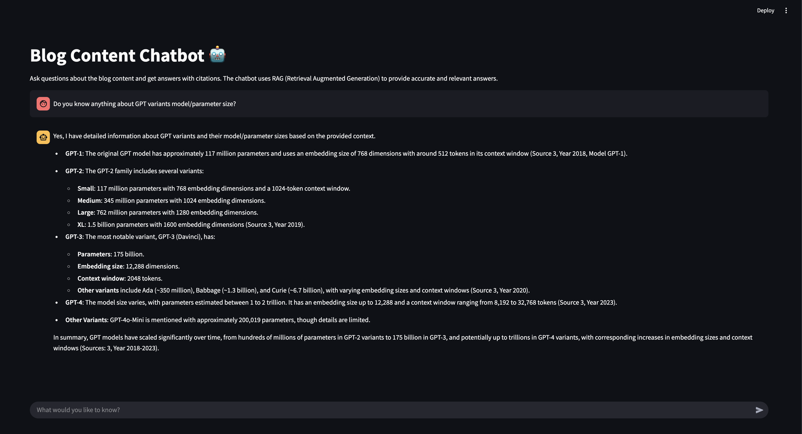
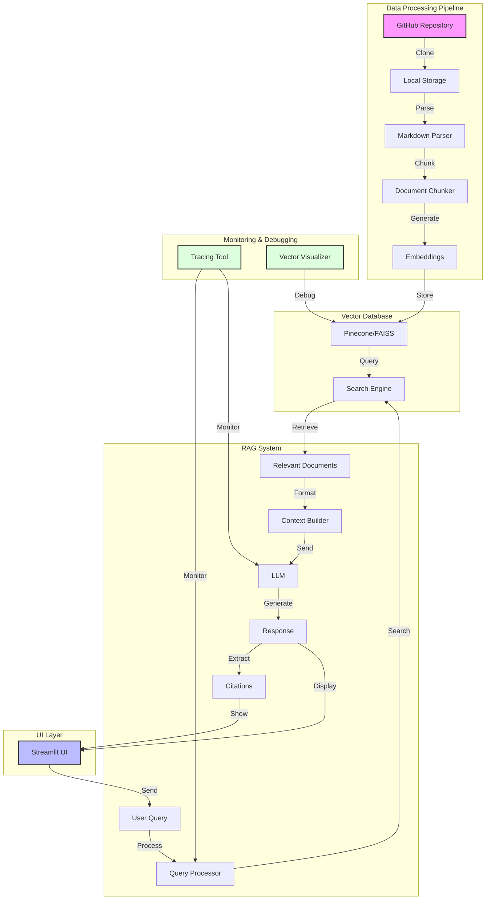

# Personal Blog Chatbot

A chatbot that helps search and answer questions about my blog content using RAG (Retrieval Augmented Generation) and LLMs.

## Features

- Search and answer questions about my blog content
- Citations for all answers
- Modular architecture for easy switching of components
- Support for multiple LLM providers
- Clean and intuitive UI

## Screenshots



## Architecture

The system consists of several key components:

1. **Data Processing Pipeline**
   - GitHub content cloning
   - Markdown parsing
   - Document chunking
   - Embedding generation

2. **Vector Database**
   - Pinecone integration
   - Alternative: FAISS for local storage

3. **RAG Implementation**
   - Document retrieval
   - Context management
   - Citation tracking

4. **LLM Integration**
   - Multiple provider support
   - Conversation management
   - Response generation

5. **UI Layer**
   - Streamlit/Gradio interface
   - User interaction handling

## System Flow



## Setup

1. Clone the repository
2. Ensure atleast Python 3.11 is used
3. Install dependencies: 
   - `pip install -r requirements.txt`
4. Configure environment variables
5. Test the application: `python src/test_implementation.py`
6. Run the application: `streamlit run src/app.py`
   - To circumvent versioning issue if exists, `$(which python) -m streamlit run src/app.py`


## Configuration

Create a `.env` file with the following variables:

```env
GITHUB_REPO_URL=https://github.com/prasanth-ntu/prasanth.io
GITHUB_BRANCH=v4
VECTOR_DB_TYPE=pinecone  # or faiss
LLM_PROVIDER=openai  # or other providers
```

## Usage

1. Start the application
2. Enter your questions in the chat interface
3. Receive answers with citations

## Development

The project is structured to be modular and extensible. Key components can be swapped out by implementing the appropriate interfaces.

## To do's

### High Priority
- Find open source alternative for OpenAI as it's not cost-effective
- Add support for multiple document formats (PDF, DOCX, etc.)
- Implement caching mechanism for frequently asked questions
- Add user feedback mechanism to improve answer quality
- Implement periodic update of embeddings when existing files change and new files are added

### Medium Priority
- Add support for multiple languages
- Implement conversation history persistence
- Add support for file uploads for custom knowledge base
- Improve citation accuracy and relevance
- Add support for code snippets in responses
- Implement rate limiting for API calls
- Add LangChain or equivalent open source web/UI based tracing tool for debugging
- Add embedding vectors visualization/debugger UI (using Pinecone or open source alternative for FAISS)

### Low Priority
- Add dark mode support
- Implement analytics dashboard
- Add support for voice input/output
- Create API documentation
- Add unit tests and integration tests
- Implement CI/CD pipeline
- Add Docker support for easy deployment
- Create developer documentation

### Potential Improvements
- Implement semantic search improvements
- Add support for custom embeddings
- Implement better context window management
- Add support for multiple vector databases
- Improve error handling and user feedback
- Add support for custom prompt templates
- Implement better document preprocessing
- Add support for custom LLM fine-tuning

## License
MIT License
